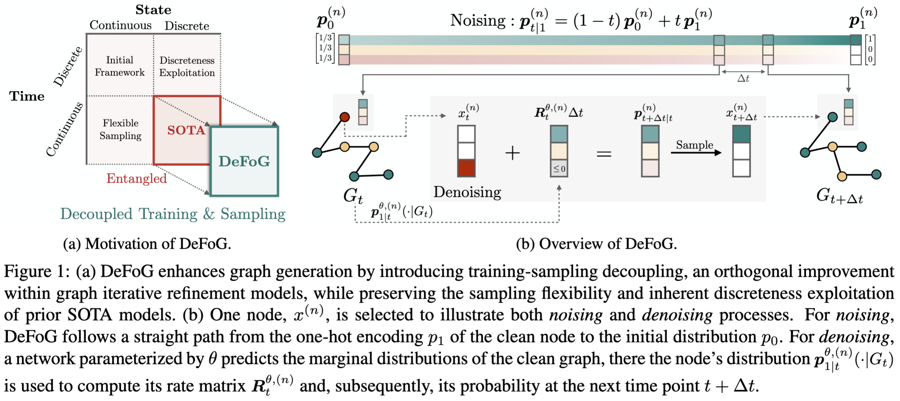
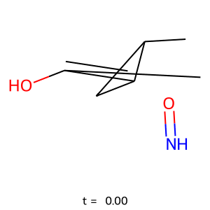
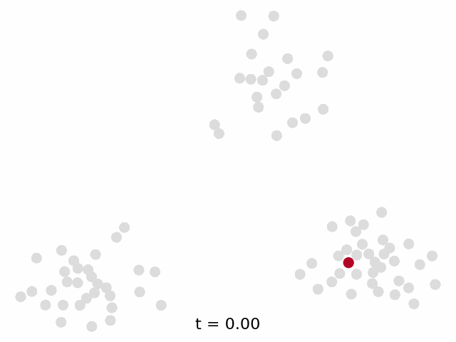

# DeFoG: Discrete Flow Matching for Graph Generation

> A PyTorch implementation of the DeFoG model for training and sampling discrete graph flows.  
> Paper: https://arxiv.org/pdf/2410.04263




<p align="middle">
  
   
</p>

---

## 🚀 Installation

We provide two alternative installation methods: Docker and Conda.

### 🐳 Docker 

We provide the Dockerfile to run DeFoG in a container.
1. Build the Docker image:  
   ```bash
   docker build --platform=linux/amd64 -t defog-image .
   ``` 

⚠️ Once you clone DeFoG's git repository to your workspace, you may need to run `pip install -e .` to make all the repository modules visible.


### 🐍 Conda 

1. Install Conda (we used version 25.1.1) and create DeFoG's environment:  
   ```bash
   conda env create -f environment.yaml
   conda activate defog
   ```
2. Run the following commands to check if the installation of the main packages was successful:  
   ```bash
   python -c "import sys; print('Python version:', sys.version)"
   python -c "import rdkit; print('RDKit version:', rdkit.__version__)"
   python -c "import graph_tool as gt; print('Graph-Tool version:', gt.__version__)"
   python -c "import torch; print(f'PyTorch version: {torch.__version__}, CUDA version (via PyTorch): {torch.version.cuda}')"
   python -c "import torch_geometric as tg; print('PyTorch Geometric version:', tg.__version__)"
   ```
   If you see no errors, the installation was successful and you can proceed to the next step.
3. Compile the ORCA evaluator:  
   ```bash
   cd src/analysis/orca
   g++ -O2 -std=c++11 -o orca orca.cpp
   ```

⚠️ Tested on Ubuntu.

---

## ⚙️ Usage

All commands use `python main.py` with [Hydra](https://hydra.cc/) overrides. Note that `main.py` is inside the `src` directory.

### Quick start  

Use this script to quickly test the code.

```bash
python main.py +experiment=debug
```

### Full training  

```bash
python main.py +experiment=<dataset> dataset=<dataset>
```

- **QM9 (no H):** `+experiment=qm9_no_h dataset=qm9`  
- **Planar:** `+experiment=planar dataset=planar`
- **SBM:** `+experiment=sbm dataset=sbm`
- **Tree:** `+experiment=tree dataset=tree`
- **Comm20:** `+experiment=comm20 dataset=comm20`
- **GuacaMol:** `+experiment=guacamol dataset=guacamol`
- **MOSES:** `+experiment=moses dataset=moses`
- **QM9 (with H):** `+experiment=qm9_with_h dataset=qm9`
- **TLS (conditional):** `+experiment=tls dataset=tls`

---

## 📊 Evaluation

Sampling from DeFoG is typically done in two steps:

1. **Sampling Optimization** → find best sampling configuration  
2. **Final Evaluation** → measure performance under the best configuration


To perform 5 runs (mean ± std), set `general.num_sample_fold = 5`.

For the rest of this section, we take Planar dataset as an example:

### Default sampling  
```bash
python main.py +experiment=planar dataset=planar general.test_only=path/to/checkpoint sample.eta=0 sample.omega=0 sample.time_distortion=identity
```

### Sampling optimization
To search over the optimal inference hyperperameters (η, ω, distortion), use the `sample.search` flag, which will save a csv file with the results.
- **Non-grid search** (independent search for each component):  
  ```bash
  python main.py +experiment=planar dataset=planar general.test_only=path/to/checkpoint sample.search=all
  ```
- **Component-wise**: set `sample.search=target_guidance | distortion | stochasticity` above.

⚠️ We set the default search intervals for each sampling parameter as we used in our experiments. You may want to adjust these intervals according to your needs.

### Final evaluation  
Use optimal η, ω, time distortion resulting from the search:  
```bash
python main.py +experiment=planar dataset=planar general.test_only=path/to/checkpoint sample.eta=<η> sample.omega=<ω> sample.time_distortion=<distortion>
```

---

## 🌐 Extend DeFoG to new datasets

Start by creating a new file in the `src/datasets` directory. You can refer to the following scripts as examples:
- `spectre_dataset.py`, if you are using unattributed graphs;
- `tls_dataset.py`, if you are using graphs with attributed nodes;
- `qm9_dataset.py` or `guacamol_dataset.py`, if you are using graphs with attributed nodes and edges (e.g., molecular data).

This new file should define a `Dataset` class to handle data processing (refer to the [PyG documentation](https://pytorch-geometric.readthedocs.io/en/latest/tutorial/create_dataset.html) for guidance), as well as a `DatasetInfos` class to specify relevant dataset properties (e.g., number of nodes, edges, etc.).

Once your dataset file is ready, update `main.py` to incorporate the new dataset. Additionally, you can add a corresponding file in the `configs/dataset` directory.

Finally, if you are planning to introduce custom metrics, you can create a new file under the `metrics` directory.

---

## Checkpoints

Checkpoints and their corresponding results are shared in the this [folder](https://drive.google.com/drive/folders/1TAzMf8uw7o4fORS9XKH4ywfnSnIjWoxo?usp=sharing).
Currently, we provide checkpoints for the datasets with a checkmark (✅):

- Synthetic datasets:
  - Planar: ✅
  - Tree: ✅
  - SBM: ❌

- Molecular datasets:
   - QM9 (without H): ❌
   - GuacaMol: ❌
   - MOSES: ❌

---

## 📌 TODO upon request

- ZINC / protein / EGO datasets  
- FCD score for molecules
- W&B sweeps for sampling optimization  


---
## 🙏 Acknowledgements

- DiGress: https://github.com/cvignac/DiGress
- Discrete Flow Models: https://github.com/andrew-cr/discrete_flow_models

---

## 📚 Citation

```bibtex
@article{qinmadeira2024defog,
  title     = {DeFoG: Discrete Flow Matching for Graph Generation},
  author    = {Qin, Yiming and Madeira, Manuel and Thanou, Dorina and Frossard, Pascal},
  year      = {2024},
  url       = {https://arxiv.org/abs/2410.04263}
}
```
